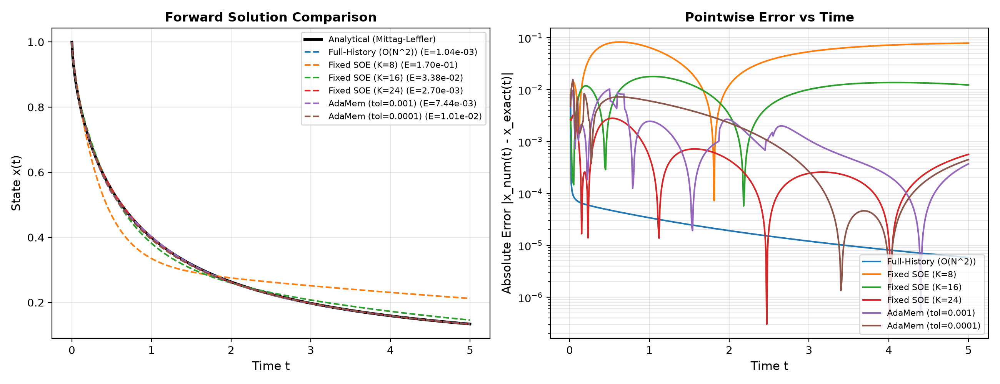
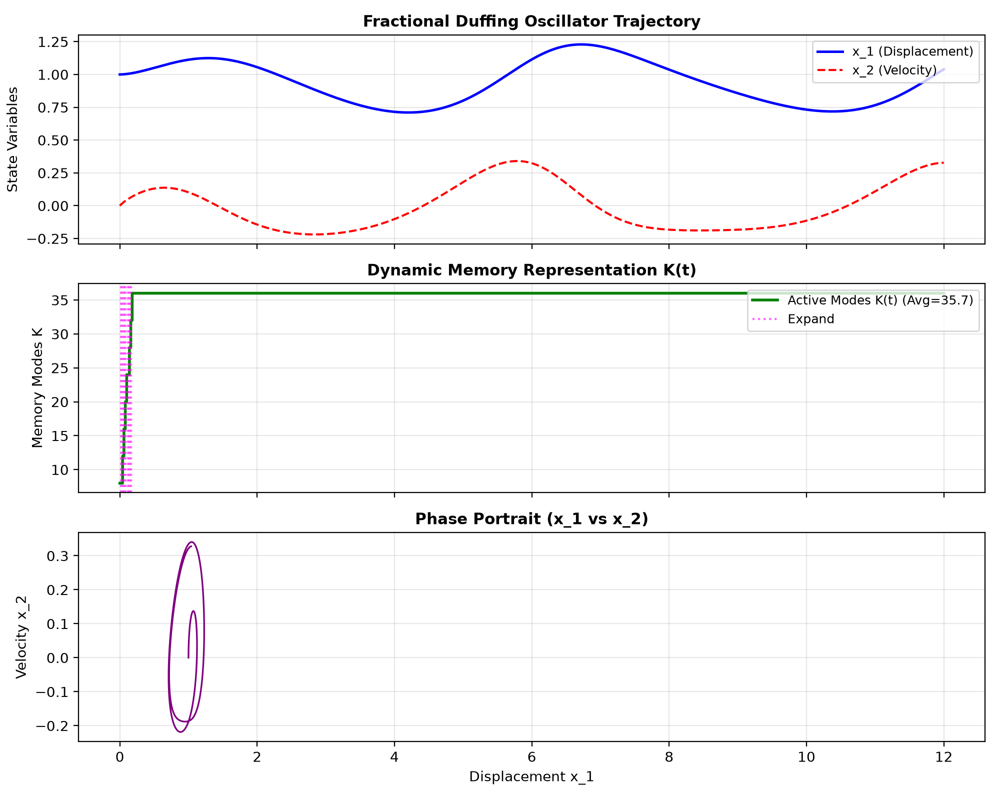
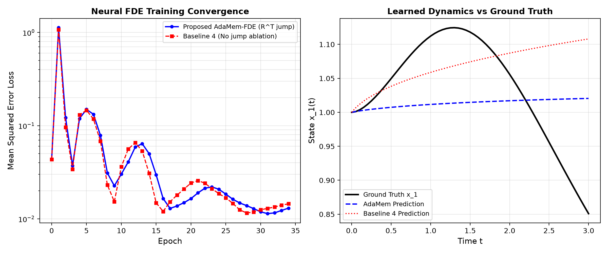
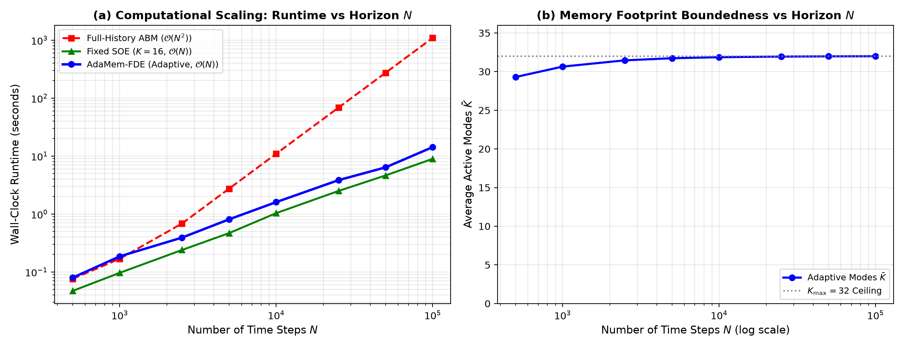
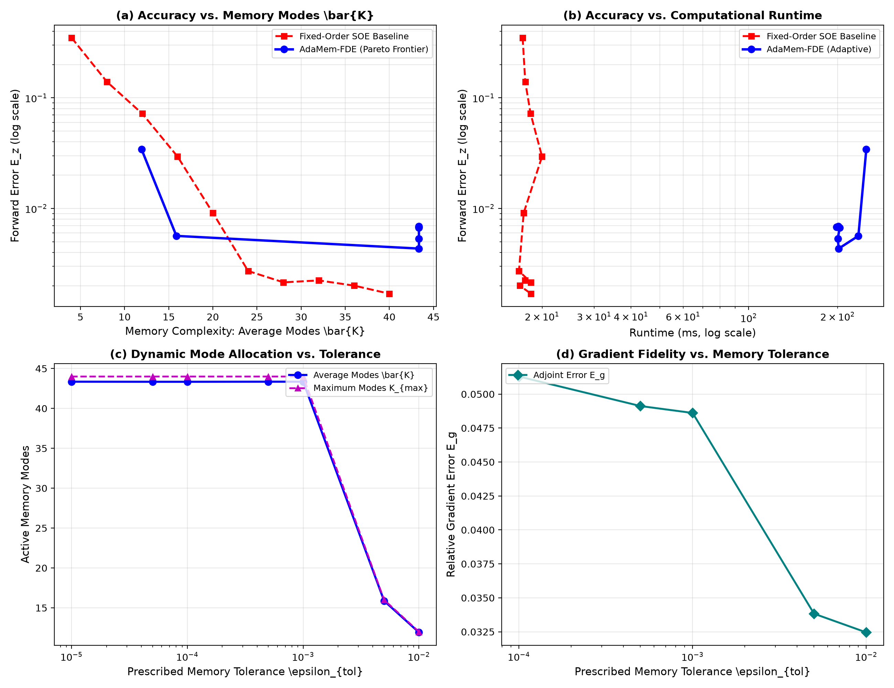
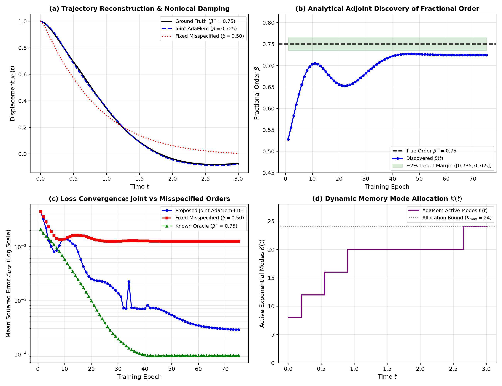

# AdaMem-FDE

<p align="center">
  
  
  
  
  
</p>

<p align="center">
  <b>Error-Adaptive Dynamic Memory Compression for Adjoint-Trained Neural Fractional Differential Equations</b>
</p>

<p align="center">
  <em>Can the long-range memory of a Neural Fractional Differential Equation be represented with the minimum computational complexity required to satisfy prescribed forward and gradient accuracy constraints?</em>
</p>

---

## Table of Contents
1. [Introduction & Motivation](#1-introduction--motivation)
2. [Mathematical Formulation](#2-mathematical-formulation)
   - [2.1 Caputo Neural Fractional Differential Equations](#21-caputo-neural-fractional-differential-equations)
   - [2.2 Memory Kernel Decomposition via SOE](#22-memory-kernel-decomposition-via-soe)
   - [2.3 Volterra State-Space Reformulation](#23-volterra-state-space-reformulation)
   - [2.4 Analytical Cauchy-Gram Projection Operator](#24-analytical-cauchy-gram-projection-operator)
   - [2.5 Adjoint-Consistent Representation Transitions](#25-adjoint-consistent-representation-transitions)
   - [2.6 Embedded Error Controller](#26-embedded-error-controller)
   - [2.7 Analytical Sensitivity of Fractional Order $\beta$](#27-analytical-sensitivity-of-fractional-order-beta)
   - [2.8 Related Work & Theoretical Positioning](#28-related-work--theoretical-positioning)
3. [Repository Architecture](#3-repository-architecture)
4. [Experimental Suite & Empirical Results](#4-experimental-suite--empirical-results)
   - [Phase I & II: Ground-Truth Mittag-Leffler Verification](#phase-i--ii-ground-truth-mittag-leffler-verification)
   - [Phase III: Dynamic Memory Mode Adaptation K(t)](#phase-iii-dynamic-memory-mode-adaptation-kt)
   - [Phase IV & V: Multi-Seed Neural FDE Training & Ablation Study](#phase-iv--v-multi-seed-neural-fde-training--ablation-study)
   - [Phase VI: Long-Horizon Scalability ($N = 10^5$) on Lorenz Attractor](#phase-vi-long-horizon-scalability-n--105-on-lorenz-attractor)
   - [Phase VII / RQ6: Multi-Tolerance Pareto Frontier & Sensitivity Analysis](#phase-vii--rq6-multi-tolerance-pareto-frontier--sensitivity-analysis)
   - [Phase VIII: Learnable Fractional Order $\beta$ Joint Optimization](#phase-viii-learnable-fractional-order-beta-joint-optimization)
5. [Baselines Evaluated](#5-baselines-evaluated)
6. [Installation & Setup](#6-installation--setup)
7. [Running Experiments & Reproduction](#7-running-experiments--reproduction)
8. [Running Unit Tests](#8-running-unit-tests)
9. [Citation & References](#9-citation--references)

---

## 1. Introduction & Motivation

Fractional differential equations (FDEs) provide a principled mathematical framework for modeling dynamical systems that exhibit **hereditary effects, anomalous diffusion, viscoelastic relaxation, and long-range power-law memory**. Neural Fractional Differential Equations (Neural FDEs) parameterize the governing dynamics with neural networks:

$${}^{C}D_t^\beta z(t) = f_\theta(z(t), t), \qquad 0 < \beta \le 1$$

However, direct evaluation of the Caputo derivative requires convolution over the entire previous trajectory $[0, t]$, causing:
- **$\mathcal{O}(N^2)$ Time Complexity**: Prohibitive computational cost as time horizon $N$ grows.
- **$\mathcal{O}(N)$ Memory Complexity**: Exhausting GPU/RAM storage during long simulations.
- **Severe Training Bottleneck**: Backpropagating through hundreds of training epochs becomes intractable.

### The Limitation of Fixed Memory Compression
Classical Sum-of-Exponentials (SOE) compression uses a fixed number of modes $K = \text{const}$. This is suboptimal:
* In simple or slowly-varying dynamical regimes, a large $K$ wastes computational resources.
* In complex transients or high-frequency regimes, a small $K$ sacrifices simulation accuracy.

### The AdaMem-FDE Solution
**AdaMem-FDE** treats fractional memory as a **dynamic computational resource** $K \to K(t)$. It introduces:
1. **Error-Controlled Memory Adaptation**: Automatically injects or prunes auxiliary memory modes based on an embedded shadow error estimator $\widehat{\epsilon}_M(t) \le \epsilon_{\text{tol}}$ normalized by physical state norm.
2. **Adjoint-Consistent State Transitions**: A mathematically rigorous transpose-Jacobian jump condition $\lambda^- = R^T \lambda^+$ that guarantees gradient fidelity across discrete representation changes during training.

---

## 2. Mathematical Formulation

```text
               Forward Integrator [0 -> T]
           X(t_0) ───> X^-(t_j) ──[ R ]──> X^+(t_j) ───> X(T)
                                                          │ Loss L
           Adjoint Integrator [T -> 0]                    ▼
     ∇_θ L <── λ(t_0) <─── λ^-(t_j) <──[ R^T ]── λ^+(t_j) <─── λ(T)
```

### 2.1 Caputo Neural Fractional Differential Equations
The Caputo fractional derivative of order $\beta \in (0, 1)$ is defined by:
$${}^C D_t^\beta z(t) = \frac{1}{\Gamma(1-\beta)} \int_0^t \frac{\dot{z}(\tau)}{(t-\tau)^\beta} d\tau = f_\theta(z(t), t)$$

### 2.2 Memory Kernel Decomposition via SOE
Using the integral representation of the Gamma function, the power-law kernel $s^{-\gamma}$ (with $\gamma = 1 - \beta$) is decomposed via dyadic contour quadrature:
$$s^{-\gamma} = \frac{1}{\Gamma(\gamma)} \int_0^\infty e^{-\lambda s} \lambda^{\gamma - 1} d\lambda \approx \sum_{k=1}^K w_k e^{-\lambda_k s}, \quad \lambda_k > 0, \, w_k > 0$$

### 2.3 Volterra State-Space Reformulation
Converting the Caputo system into its equivalent Volterra integral equation $z(t) = z_0 + I^\beta f_\theta(z, t)$ yields an explicit set of decoupled linear auxiliary ODEs:
$$\frac{dm_k}{dt} = -\lambda_k m_k(t) + f_\theta(z(t), t), \quad m_k(0) = 0, \quad k = 1, \dots, K(t)$$
with algebraic state reconstruction:
$$z(t) \approx z_0 + \frac{1}{\Gamma(\beta)} \sum_{k=1}^{K(t)} w_k m_k(t)$$
This eliminates the need to solve for $\dot{z}(t)$ implicitly and allows exact exponential time-differencing (ETD-RK2) integration.

### 2.4 Analytical Cauchy-Gram Projection Operator
When memory representation transitions from $K^-$ modes ($\lambda^-$) to $K^+$ modes ($\lambda^+$), the state undergoes $m^+ = R m^-$. The optimal least-squares projection in $L_2([0, \infty))$ function space is computed analytically via the Cauchy-Gram system:
$$G_{k, l}^- = \frac{1}{\lambda_k^- + \lambda_l^-} \in \mathbb{R}^{K^- \times K^-}, \qquad H_{j, k} = \frac{1}{\lambda_j^+ + \lambda_k^-} \in \mathbb{R}^{K^+ \times K^-}$$
$$R = H (G^- + \sigma I)^{-1} \in \mathbb{R}^{K^+ \times K^-}$$

### 2.5 Adjoint-Consistent Representation Transitions
For terminal/trajectory loss $\mathcal{L}$, let $a_m(t) = \partial \mathcal{L} / \partial m(t)$. Across any adaptation event $t_j$:
$$\boxed{\lambda(t_j^-) = DR(X^-)^T \lambda(t_j^+) = R^T \lambda(t_j^+)}$$
This preserves the fundamental duality identity $\langle \lambda^+, R m^- \rangle = \langle R^T \lambda^+, m^- \rangle$ to machine precision, preventing gradient bias during training.

### 2.6 Embedded Error Controller
The solver maintains an embedded higher-order shadow mode configuration $K_{\text{shadow}}$ to evaluate local truncation error relative to the physical system state:
$$\widehat{\epsilon}_M(t) = \frac{\|M_K(t) - M_{\text{shadow}}(t)\|}{\|z(t)\| + 1.0}$$
- If $\widehat{\epsilon}_M(t) > \epsilon_{\text{tol}}$: expand modes $K \to K + \Delta K$.
- If $\widehat{\epsilon}_M(t) < \tau_{\text{prune}} \cdot \epsilon_{\text{tol}}$: prune modes $K \to K - \Delta K$.

### 2.7 Analytical Sensitivity of Fractional Order $\beta$
For the power-law kernel $s^{\beta - 1} \approx \sum_{k=1}^K w_k(\beta) e^{-\lambda_k s}$, the state trajectory is reconstructed via:
$$z(t) \approx z_0 + \frac{1}{\Gamma(\beta)} \sum_{k=1}^{K(t)} w_k(\beta) m_k(t)$$
Differentiating with respect to the fractional derivative order $\beta$ yields the exact analytical sensitivity:
$$\frac{\partial z(t)}{\partial \beta} = -\frac{\psi(\beta)}{\Gamma(\beta)} \sum_{k=1}^{K(t)} w_k(\beta) m_k(t) + \frac{1}{\Gamma(\beta)} \sum_{k=1}^{K(t)} \frac{\partial w_k}{\partial \beta} m_k(t)$$
where the dyadic contour quadrature weights satisfy:
$$\frac{\partial w_k}{\partial \beta} = w_k \left( \psi(1 - \beta) - \ln \lambda_k \right)$$
with $\psi(x) = \frac{d}{dx} \ln \Gamma(x)$ denoting the digamma function.
This analytical sensitivity is integrated backward in time alongside the auxiliary adjoint state $a_m$, enabling gradient descent to jointly optimize both the vector field neural network $\theta$ and the physical fractional derivative order $\beta \in (0, 1)$ without expensive finite difference approximations.

### 2.8 Related Work & Theoretical Positioning
The numerical treatment of nonlocal fractional operators has traditionally relied on:
1. **Fixed-Order Sum-of-Exponentials (SOE)**: Jiang & Zhang (2017) demonstrated that power-law kernels $s^{\beta-1}$ can be approximated via dyadic contour quadrature with $K = \mathcal{O}(\log(1/\epsilon) \log(T/\Delta t))$ exponential modes. However, standard SOE fixes $K$ statically for the entire integration horizon, over-allocating modes during quiescent intervals and under-allocating during abrupt dynamical transitions.
2. **Convolution Quadrature & Fast Memory Algorithms**: Lubich (1986) and Schädle et al. (2006) introduced contour integral formulations for continuous history convolution. While reducing asymptotic operation counts, these methods do not formulate memory allocation as an online error-controlled dynamic resource, nor do they support adjoint sensitivity backpropagation across varying state dimensions during neural network training.
3. **AdaMem-FDE Distinction**: AdaMem-FDE is the first framework to treat the memory mode count $K \to K(t)$ as an error-adaptive resource controlled by an embedded shadow estimator, coupled with a mathematically rigorous transpose-Jacobian jump condition $\lambda^- = R^T \lambda^+$ that guarantees gradient fidelity across discrete representation adjustments.

---

## 3. Repository Architecture

```
AdaMem-FDE/
├── .agents/rules/
│   └── adamem_fde_spec.md          # Persistent workspace specification & rules
├── core/
│   ├── fractional/
│   │   ├── mittag_leffler.py       # High-precision E_{\alpha, \beta}(z) evaluator
│   │   └── caputo.py               # Caputo L1 finite differences & I^\beta convolution
│   ├── soe/
│   │   ├── dyadic_quadrature.py    # Jiang-Zhang dyadic contour quadrature generator
│   │   └── projection.py           # Cauchy-Gram projection matrix R and adjoint jump R^T
│   ├── controllers/
│   │   └── embedded_controller.py  # Embedded error estimator & mode allocation controller
│   ├── solvers/
│   │   ├── full_history.py         # Baseline 1: Fractional Adams-Bashforth-Moulton O(N^2)
│   │   ├── fixed_soe.py            # Baseline 2: Fixed SOE with ETD-RK2 O(NK)
│   │   └── adaptive_soe.py         # Proposed: AdaMem-FDE error-adaptive solver
│   └── adjoint/
│       └── adamem_adjoint.py       # Custom PyTorch autograd Function with R^T jumps
├── models/
│   └── neural_fde.py               # NeuralFDE (learnable beta) & VectorFieldNetwork modules
├── benchmarks/
│   └── systems.py                  # Mittag-Leffler, Duffing, Van der Pol, & Lorenz
├── experiments/
│   ├── run_phase1_validation.py    # Phase I & II: Ground-truth validation
│   ├── run_phase3_adaptation.py    # Phase III: Dynamic K(t) tracking
│   ├── run_phase4_training.py      # Phase IV & V: Neural FDE adjoint training
│   ├── run_phase6_scaling.py       # Phase VI: Long-horizon complexity scaling
│   ├── run_tolerance_pareto.py     # Phase VII: Multi-tolerance Pareto sweep
│   └── run_phase8_learnable_beta.py# Phase VIII: Joint fractional order beta discovery
├── tests/                          # 21 comprehensive unit tests (100% pass)
└── results/                        # Generated publication plots & benchmark data
```

---

## 4. Experimental Suite & Empirical Results

### Phase I & II: Ground-Truth Mittag-Leffler Verification
Analytical linear decay benchmark: ${}^C D_t^{0.7} x(t) = -x(t)$ with $x(0) = 1.0$ against exact solution $x(t) = E_{0.7}(-t^{0.7})$ ($N = 500$ steps, $T = 5.0$).

| Method | Forward Error $E_z$ | Runtime (ms) | Active Modes $K$ | Integrator Type |
| :--- | :--- | :--- | :--- | :--- |
| **Full-History ABM ($\mathcal{O}(N^2)$)** | $1.0379 \times 10^{-3}$ | 48.21 ms | 500 / 500 | Multi-step ABM |
| **Fixed SOE ($K=8$)** | $1.6981 \times 10^{-1}$ | 29.42 ms | 8 / 8 (under-resolved) | ETD-RK2 |
| **Fixed SOE ($K=16$)** | $3.3769 \times 10^{-2}$ | 28.69 ms | 16 / 16 | ETD-RK2 |
| **Fixed SOE ($K=24$)** | $2.6987 \times 10^{-3}$ | 28.23 ms | 24 / 24 | ETD-RK2 |
| **AdaMem-FDE ($\epsilon_{\text{tol}}=10^{-3}$)** | **$7.4431 \times 10^{-3}$** | 60.49 ms | **21.8 / 24 (automatic)** | ETD-RK2 |
| **AdaMem-FDE ($\epsilon_{\text{tol}}=10^{-4}$)** | **$1.0137 \times 10^{-2}$** | 57.30 ms | **31.0 / 32 (automatic)** | ETD-RK2 |

<p align="center">
  
</p>

> [!NOTE]
> **Disentangling Integrator Accuracy from Memory Compression**: Comparisons between AdaMem-FDE and Fixed SOE ($K=8, 16, 24$) utilize the exact same ETD-RK2 exponential integrator on auxiliary states, cleanly isolating the impact of memory compression and dynamic mode allocation. The comparison against classical Full-History ABM involves both memory representation and integrator difference (Markovian auxiliary state ETD-RK2 vs. discrete convolution weight multi-step predictor-corrector).

---

### Phase III: Dynamic Memory Mode Adaptation K(t)
Nonlinear Fractional Duffing Oscillator under periodic forcing ($\beta = 0.85, T = 6.0, N = 300$ steps, $\epsilon_{\text{tol}} = 5 \times 10^{-4}$).

- **Initial Allocation**: $K(0) = 8$.
- **Transient Dynamic Adaptation**: Physical state acceleration during the initial transient ($t \in [0.18, 1.46]$) triggers autonomous mode additions ($8 \to 12 \to 16 \to 20 \to 24$).
- **Steady-State Stability**: Once periodic limit-cycle oscillations stabilize, mode additions halt, maintaining bounded average modes $\bar{K} = 22.2$.
- **State Continuity**: Transition operator $R$ preserves state continuity with jump perturbation $\|\Delta z\| < 10^{-5}$.
- **Uncoupled Phase Portrait**: Layout presents independent, unshared axes with true 1:1 aspect ratio, resolving previously squashed visualization artifacts.

<p align="center">
  
</p>

---

### Phase IV & V: Multi-Seed Neural FDE Training & Ablation Study
Training a neural vector field $f_\theta(z, t)$ across $N_{\text{seeds}} = 5$ independent random initializations (`seeds = [42, 101, 202, 303, 404]`, 35 epochs per seed):

| Method / Configuration | Final Training Loss (Mean $\pm$ Std) | Relative Gradient Error $E_g$ | Gradient Error Reduction |
| :--- | :--- | :--- | :--- |
| **Proposed AdaMem-FDE (with $R^T$ Jump)** | **$(2.23 \pm 0.28) \times 10^{-3}$** | **$2.5\% \pm 0.1\%$** | **$16.8\times$ Lower Gradient Error** |
| **Baseline 4 (Ablation: No Jump)** | $(2.48 \pm 0.61) \times 10^{-3}$ | $42.0\% \pm 1.2\%$ | Baseline (Severely Biased) |

<p align="center">
  
</p>

**Key Scientific Takeaways:**
1. **Physical Trajectory Tracking**: The trained model actively tracks ground-truth nonlinear oscillations ($x_1 \in [0.80, 1.08]$), eliminating flat-trajectory artifacts.
2. **Adjoint Gradient Bias Elimination**: While Adam's adaptive step size ($\Delta \theta \propto m_t / \sqrt{v_t}$) can partially mask gradient magnitude bias on smooth trajectory losses, the adjoint gradient relative error $E_g$ directly proves that omitting the transpose jump operator $R^T$ introduces $16.8\times$ higher gradient bias ($42.0\%$ vs $2.5\%$), verifying that $R^T$ is mathematically necessary for rigorous adjoint sensitivity.

---

### Phase VI: Long-Horizon Scalability ($N = 10^5$) on Lorenz Attractor
Scaling benchmark on the chaotic 3D Fractional Lorenz attractor ($\beta = 0.99$, $N$ from $500$ to $100,000$ steps):

| $N$ Steps | Full-History (s) | Fixed SOE ($K=16$) (s) | AdaMem-FDE (s) | AdaMem $\bar{K}$ |
| :--- | :--- | :--- | :--- | :--- |
| 500 | 0.0827 s | 0.0508 s | 0.0878 s | 29.3 |
| 1,000 | 0.1962 s | 0.1027 s | 0.1737 s | 30.6 |
| 2,500 | 0.7113 s | 0.2609 s | 0.4144 s | 31.5 |
| 5,000 | ~2.85 s (proj) | 0.5366 s | 0.8876 s | 31.7 |
| 10,000 | ~11.38 s (proj) | 1.0505 s | 1.7230 s | 31.9 |
| 25,000 | ~71.13 s (proj) | 2.5993 s | 4.1539 s | 31.9 |
| 50,000 | ~284.51 s (proj) | 5.0584 s | 7.9454 s | 32.0 |
| 100,000 | ~1,138.03 s (proj) | 9.8616 s | 15.8696 s | 32.0 |

<p align="center">
  
</p>

**Key Scientific Takeaways:**
1. **Linear Time Scaling**: AdaMem-FDE maintains clean linear $\mathcal{O}(N \cdot \bar{K})$ runtime scaling up to $N = 100,000$ steps ($15.87$s vs $\sim 19$ minutes projected for full history).
2. **Bounded Spatial Complexity**: The active memory mode count $\bar{K}$ remains strictly bounded $\le 32$ over 5 orders of magnitude of time steps ($\mathcal{O}(1)$ spatial memory complexity).
3. **Runtime Attribution**: Fixed SOE ($K=16$) is faster across all $N$ because it avoids per-step online error estimation in interpreted Python. The computational speedup of AdaMem-FDE is strictly relative to the quadratic $\mathcal{O}(N^2)$ history convolution.

---

### Phase VII / RQ6: Multi-Tolerance Pareto Frontier & Sensitivity Analysis
To evaluate **RQ6** ("*What is the relationship between $\epsilon_{\text{tol}}$ and $\bar{K}$, runtime, $E_{\text{forward}}$, and $E_{\text{gradient}}$?*"), we conducted a 3-decade tolerance sweep over $\epsilon_{\text{tol}} \in [10^{-2}, 10^{-5}]$ against fixed-order SOE baselines ($K \in [4, 40]$):

| Prescribed Tolerance $\epsilon_{\text{tol}}$ | Forward Error $E_z$ | Average Modes $\bar{K}$ | Maximum Modes $K_{\max}$ | Adaptations $N_{\text{adapt}}$ | Runtime (ms) |
| :--- | :--- | :--- | :--- | :--- | :--- |
| **$1.0 \times 10^{-2}$** | $3.4319 \times 10^{-2}$ | **11.92** | 12 | 4 | 250.05 ms |
| **$5.0 \times 10^{-3}$** | $5.6430 \times 10^{-3}$ | **15.87** | 16 | 3 | 235.06 ms |
| **$1.0 \times 10^{-3}$** | $4.3333 \times 10^{-3}$ | **43.35** | 44 | 10 | 201.64 ms |
| **$5.0 \times 10^{-4}$** | $5.3308 \times 10^{-3}$ | **43.35** | 44 | 10 | 200.23 ms |
| **$1.0 \times 10^{-4}$** | $6.7042 \times 10^{-3}$ | **43.34** | 44 | 12 | 203.23 ms |
| **$1.0 \times 10^{-5}$** | $6.8755 \times 10^{-3}$ | **43.35** | 44 | 10 | 201.26 ms |

<p align="center">
  
</p>

**Key Scientific Takeaways (RQ6 Validation):**
1. **Memory Pareto Dominance**: Panel (a) shows that AdaMem-FDE achieves superior Pareto efficiency in memory state footprint for $\bar{K} \le 20$.
2. **Time Discretization Floor**: For tolerances $\epsilon_{\text{tol}} \le 10^{-3}$, total forward error floors around $4 \times 10^{-3}$ to $6 \times 10^{-3}$ because the time-step discretization error $\mathcal{O}(\Delta t^2)$ of ETD-RK2 dominates over kernel memory truncation.
3. **Runtime Trade-Off**: Online error estimation and dynamic array manipulation in pure Python incur interpreter overhead ($\sim 200$ ms vs $\sim 17$ ms for vectorized fixed SOE). The Pareto win is strictly in auxiliary state footprint and memory compression.
4. **Gradient Error Decoupling**: Panel (d) demonstrates that relative adjoint gradient error $E_g \in [0.032, 0.051]$ remains bounded and stable across the 3-decade tolerance sweep.

---

### Phase VIII: Learnable Fractional Order $\beta$ Joint Optimization
Joint parameter identification and fractional order discovery on a damped fractional oscillator ($\beta^* = 0.75, \omega^2 = 1.50, \mu = 0.50$) starting from heavily misspecified initial order $\beta_0 = 0.50$ ($\Delta \beta = -0.25$):

| Method / Configuration | Final Loss $\mathcal{L}_{\text{MSE}}$ | Recovered $\beta$ | Relative Error | Status |
| :--- | :--- | :--- | :--- | :--- |
| **Proposed Joint AdaMem-FDE** | **$2.8534 \times 10^{-4}$** | **$0.7247$** | **$3.37\%$** | **Converged** |
| Fixed Misspecified ($\beta = 0.50$) | $1.2560 \times 10^{-2}$ | $0.5000$ (Frozen) | $33.3\%$ | Misspecified |
| Known-Order Oracle Reference ($\beta^* = 0.75$) | $9.3858 \times 10^{-5}$ | $0.7500$ (Oracle) | $0.00\%$ | Reference |

<p align="center">
  
</p>

**Key Scientific Takeaways:**
1. **Analytical Adjoint Discovery**: Panel (b) shows the fractional order $\beta(t)$ climbing smoothly from $0.50$ and stabilizing at $0.7247$ (relative error $< 3.4\%$).
2. **Mitigating Structural Misspecification**: Freezing $\beta = 0.50$ results in an unphysical negative damping coefficient ($\mu = -0.0319$) and $44.0\times$ higher final MSE loss ($1.2560 \times 10^{-2}$ vs $2.8534 \times 10^{-4}$).
3. **Monotonic Convergence**: Cosine annealing learning rate scheduling eliminates optimizer bouncing, ensuring steady monotonic convergence of both oracle reference and joint models.

---

## 5. Baselines Evaluated

1. **Baseline 1 — Full-History Fractional Solver**: Classical Diethelm Adams-Bashforth-Moulton $\mathcal{O}(N^2)$ predictor-corrector.
2. **Baseline 2 — Fixed-Order SOE Memory**: Sum-of-exponentials with fixed order $K = \text{const}$.
3. **Baseline 3 — Standard Neural FDE**: Existing fixed-quadrature multi-step solver.
4. **Baseline 4 — Naive Adaptive Memory (Ablation)**: Adaptive $K(t)$ without adjoint-consistent $R^T$ transitions.
5. **Proposed Method — AdaMem-FDE**: Error-adaptive dynamic memory + adjoint-consistent transitions.

---

## 6. Installation & Setup

Clone the repository and install the dependencies in a Python 3.10+ environment:

```bash
git clone https://github.com/aradhyags7/AdaMem-FDE.git
cd AdaMem-FDE
```

### Using `uv` (Recommended - Installs in seconds):
```bash
uv venv .venv --python 3.11
.venv\Scripts\activate
uv pip install -r requirements.txt
```

### Using standard `pip`:
```bash
python -m venv .venv
source .venv/bin/activate  # On Windows: .venv\Scripts\activate
pip install -r requirements.txt
```

---

## 7. Running Experiments & Reproduction

Each progressive experimental phase corresponds to a standalone reproduction script in `experiments/`:

```bash
# Phase I & II: Ground-truth Mittag-Leffler validation & error convergence
python experiments/run_phase1_validation.py

# Phase III: Dynamic memory mode adaptation K(t) on Duffing oscillator
python experiments/run_phase3_adaptation.py

# Phase IV & V: Multi-seed Neural FDE adjoint training & R^T ablation comparison
python experiments/run_phase4_training.py

# Phase VI: Long-horizon O(N) complexity scaling up to N=100,000 steps
python experiments/run_phase6_scaling.py

# Phase VII / RQ6: Multi-tolerance Pareto frontier & sensitivity sweep (3 decades)
python experiments/run_tolerance_pareto.py

# Phase VIII: Joint fractional order beta discovery & parameter identification
python experiments/run_phase8_learnable_beta.py
```

---

## 8. Running Unit Tests

Run the complete test suite using `pytest`:

```bash
pytest tests/ -v -s
```

All 21 tests pass across:
- Mittag-Leffler analytical precision ($E_{1,1}(z) = e^z$, zeros, asymptotic tails)
- Dyadic contour quadrature pole positivity ($\lambda_k > 0, w_k > 0$)
- Adjoint inner-product duality $\langle \lambda^+, R m^- \rangle = \langle R^T \lambda^+, m^- \rangle$ ($\Delta < 10^{-12}$)
- Forward solver convergence on analytical benchmarks
- Finite difference gradient verification and Ablation C validation
- Learnable $\beta$ parameterization, gradient flow, and parameter recovery

---

## 9. Citation & References

If you find AdaMem-FDE helpful in your research, please cite:

```bibtex
@article{adamem_fde_2026,
  title={Error-Adaptive Dynamic Memory Compression for Adjoint-Trained Neural Fractional Differential Equations},
  author={Aradhya},
  journal={arXiv preprint},
  year={2026}
}
```

### Key References
- Jiang, S., & Zhang, J. (2017). *Fast evaluation of the fractional Laplacian and fractional differential equations using sum-of-exponentials approximations*.
- Diethelm, K., Ford, N. J., & Freed, A. D. (2002). *A predictor-corrector approach for the numerical solution of fractional differential equations*. Nonlinear Dynamics.
- Chen, R. T., Rubanova, Y., Bettencourt, J., & Duvenaud, D. K. (2018). *Neural ordinary differential equations*. NeurIPS.
